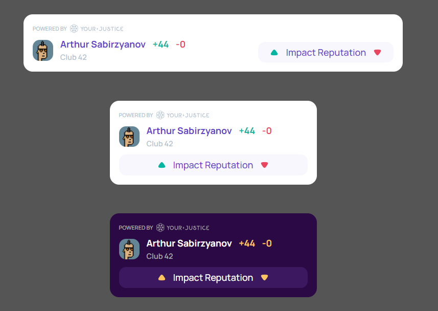

# Your Justice Widgets

Widgets that anyone can add to their own web application to integrate with the [YourJustice](https://yj.life/) platform.

## Profile Widget



This is a widget that displays the profile's overall reputation, a link to a specific jurisdiction, and a button to change the reputation by creating a case.

### Demo

[https://codesandbox.io/s/yourjurstice-profile-widget-demo-ppe8to](https://codesandbox.io/s/yourjurstice-profile-widget-demo-ppe8to)

### Usage

```html
<link
  href="https://yourjustice-live.github.io/Widgets/dist/index.css"
  rel="stylesheet"
/>
<script src="https://yourjustice-live.github.io/Widgets/dist/index.js"></script>

<div
  class="yj_profile"
  account="0x4306D7a79265D2cb85Db0c5a55ea5F4f6F73C4B1"
  jurisdiction="0x767160931f9d7cce40e9a91f22b223a40a3f59c3"
></div>
```

Don't forget to replace the **account** and **jurisdiction** with your own values.

### Props

| Name         | Default      | Description                              |
| ------------ | ------------ | ---------------------------------------- |
| account      | -            | The address of YourJustice account.      |
| jurisdiction | -            | The address of YourJustice jurisdiction. |
| variant      | "horizontal" | Can be "horizontal" or "vertical".       |

## Development

### Commands

- Runs the app in the development mode - `npm start`
- Build widget dist - `npm run build:widget`

## Community

Join us on [Discord](https://discord.gg/aKKCCzCfgS)!
